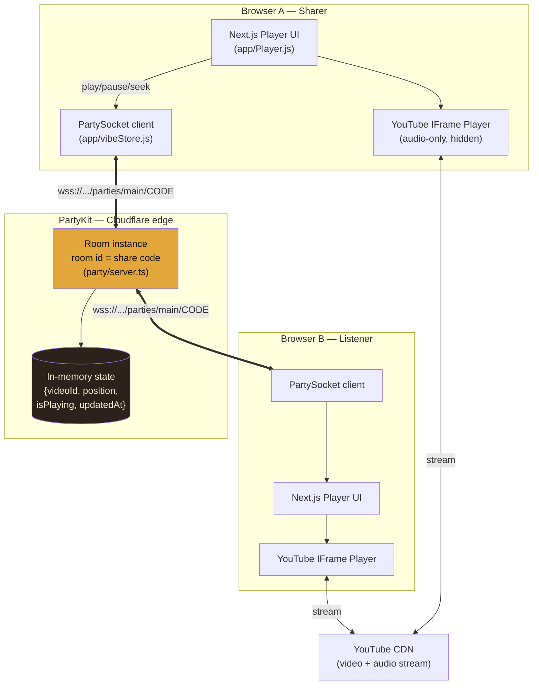
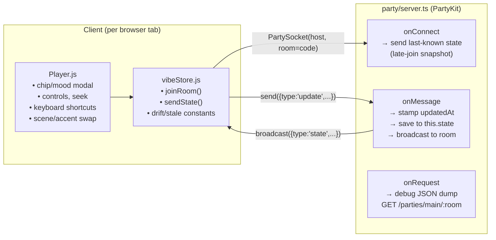
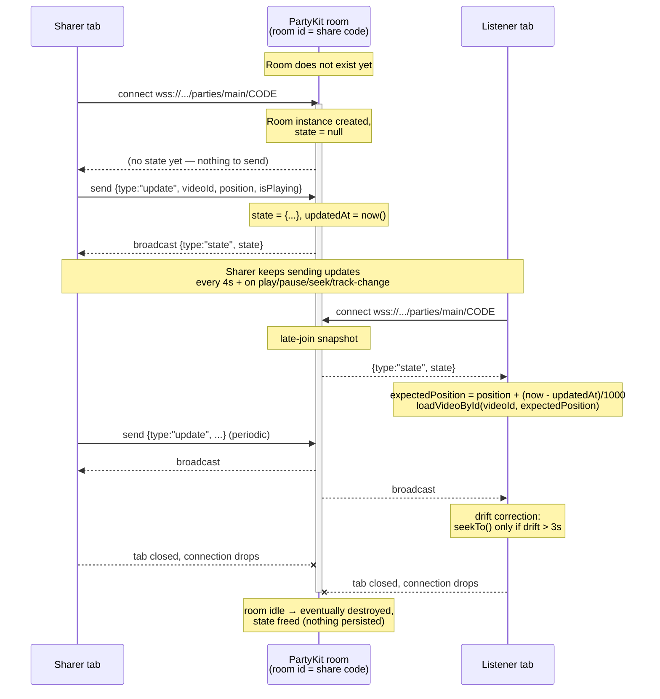

# Raat Ka Safar — Architecture

## System overview



**Key point, same as the original spec:** no audio ever passes through any server we run. YouTube's IFrame API streams directly CDN → browser for both sharer and listener. PartyKit only carries tiny JSON state messages (`videoId`, `position`, `isPlaying`, `updatedAt`) — never audio.

---

## Component map



---

## Room lifecycle (sequence)



---

## State shape (wire format)

Client → server:
```json
{ "type": "update", "videoId": "...", "trackName": "...", "position": 87.4, "isPlaying": true }
```

Server → all clients in room (including sender):
```json
{ "type": "state", "state": { "videoId": "...", "trackName": "...", "position": 87.4, "isPlaying": true, "updatedAt": 1755680000000 } }
```

`updatedAt` is stamped server-side on every message — clients never set it, so clock skew between browsers can't corrupt the drift-correction math.

---

## Why PartyKit over the original localStorage/BroadcastChannel stub

The first pass ([app/vibeStore.js](app/vibeStore.js) originally) used `localStorage` + `BroadcastChannel` to fake a shared store — worked for testing in multiple tabs on one machine, but BroadcastChannel doesn't cross devices or networks. PartyKit swaps that stub for a real WebSocket room per share code, hosted on Cloudflare's edge — same interface shape (`connect / send / receive`), zero change to the sync algorithm (drift correction, play/pause propagation, stale detection all untouched from the original spec).

## Dev vs prod

| | Command | Host |
|---|---|---|
| Local dev | `npx partykit dev` | `127.0.0.1:1999` |
| Production | `npx partykit deploy` | `raat-ka-safar-vibe.<username>.partykit.dev` |

Client picks host from `NEXT_PUBLIC_PARTYKIT_HOST` ([.env.local](.env.local)) — defaults to the local dev host, swap it after your first `partykit deploy`.
